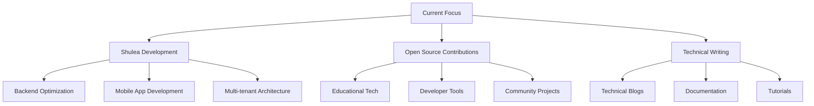

# Imran Shiundu

<div align="center">


**Building Scalable Solutions & Empowering Communities Through Code**

[](https://imranshiundu.netlify.app)
[](https://linkedin.com/in/imranshiundu)
[](https://twitter.com/imranshiundu)
[](mailto:imranshiundu@gmail.com)

*Open Source Enthusiast • Full-Stack Developer • Tech Community Builder*

</div>

## 👨‍💻 About Me

```javascript
const imran = {
  pronouns: "he" | "him",
  code: ["JavaScript", "Python", "TypeScript", "Java"],
  technologies: {
    frontend: {
      js: ["React", "Next.js", "Vue"],
      css: ["Tailwind CSS", "Styled Components", "SASS"]
    },
    backend: {
      python: ["Django", "Django REST Framework", "FastAPI"],
      js: ["Node.js", "Express"],
      java: ["Spring Boot"]
    },
    mobile: ["React Native", "Flutter"],
    databases: ["PostgreSQL", "MySQL", "MongoDB", "Redis"],
    devOps: ["Docker", "AWS", "DigitalOcean", "CI/CD"],
    tools: ["Git", "Jest", "Cypress", "Webpack", "Vite"]
  },
  architecture: ["Microservices", "REST APIs", "SPA", "PWA"],
  currentFocus: "Building Shulea - Open Source School Management System",
  funFact: "I turn coffee into code and complex problems into elegant solutions"
};
```

## 🚀 Featured Projects

### 🌟 Shulea - School Management System
**A comprehensive, cloud-native platform for educational institutions**

[](https://github.com/imranshiundu/shulea)
[](https://github.com/imranshiundu/shulea)

```yaml
Frontend: React.js, Tailwind CSS, Redux Toolkit
Backend: Django REST Framework, PostgreSQL, Redis
Features: Student Management, Fee Processing, Attendance Tracking, Exam Management
Status: 🚀 Active Development | v1.0.0 Released
```

### 🔧 Portfolio Beta
**Modern, responsive portfolio showcasing my work and skills**

[](https://github.com/imranshiundu/portfolio-Beta)
[](https://imranshiundu.netlify.app)

```yaml
Tech Stack: React, Vite, Tailwind CSS
Features: Responsive Design, Dark Mode, Project Showcase
Deployment: Netlify, GitHub Pages
```

## 📊 GitHub Statistics

<div align="center">


</div>

## 🛠️ Technical Skills

### Programming Languages


### Frontend Development


### Backend Development


### Databases & DevOps


## 📈 Contribution Graph

[](https://github.com/ashutosh00710/github-readme-activity-graph)

## 🏆 GitHub Trophies

[](https://github.com/ryo-ma/github-profile-trophy)

## 📝 Latest Blog Posts
<!-- BLOG-POST-LIST:START -->
- [Building Scalable School Management Systems with Django and React](https://dev.to/imranshiundu)
- [Microservices Architecture: Lessons from Shulea Development](https://dev.to/imranshiundu)
- [Open Source Contribution: Why Every Developer Should Get Involved](https://dev.to/imranshiundu)
<!-- BLOG-POST-LIST:END -->

## 🤝 Collaboration & Open Source

I'm passionate about open-source development and believe in building solutions that benefit the community. Currently focusing on:

- **🎓 Educational Technology** - Making school management accessible
- **🌍 Community Projects** - Contributing to meaningful open-source initiatives
- **🛠️ Developer Tools** - Building tools that improve developer productivity

### 💡 Looking to Collaborate On:
- Educational technology projects
- Open-source SaaS applications
- Developer tools and libraries
- Community-driven initiatives

## 📫 Let's Connect

<div align="center">

[](https://imranshiundu.netlify.app)
[](https://linkedin.com/in/imranshiundu)
[](https://twitter.com/imranshiundu)
[](https://github.com/imranshiundu)
[](mailto:imranshiundu@gmail.com)

</div>

## 🎯 Current Focus



## 💼 Professional Experience

### 🚀 Full-Stack Development
- **ERP Systems**: Specialized in building enterprise resource planning solutions
- **Web Applications**: Scalable, responsive web applications with modern frameworks
- **API Development**: RESTful APIs with proper documentation and testing
- **Database Design**: Optimized database schemas and query performance

### 🏆 Core Competencies
- **Problem Solving**: Transforming complex requirements into elegant solutions
- **System Architecture**: Designing scalable and maintainable systems
- **Team Leadership**: Mentoring developers and leading technical projects
- **Agile Methodology**: Experienced in Scrum and Kanban workflows

---

<div align="center">

### ⚡ **"Code is like humor. When you have to explain it, it's bad."** - Cory House

**Thanks for visiting my profile! Let's build something amazing together.** 🚀


</div>

---

*This README is dynamically updated. Last refresh: ${new Date().toLocaleDateString()}*
