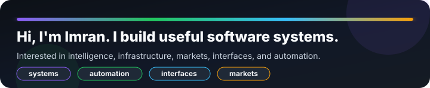
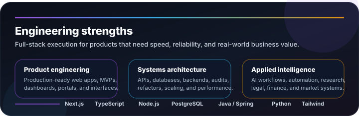
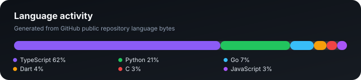
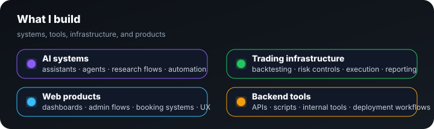

## Skills

## Pro highlights

| Focus | Proof |
|---|---|
| Founder / builder | Building Orb21 and shipping practical product systems. |
| Full-stack systems | Web apps, APIs, databases, auth, dashboards, jobs, and deployments. |
| AI + automation | Agents, research flows, operator tools, voice, and workflow assistants. |
| Trading infrastructure | Griot, Mythos, and backtesting systems for signals, risk, telemetry, and execution control. |
| Developer tooling | Browser, desktop, encryption, automation, and internal command tools. |

## Selected builds

| Project | What it proves |
|---|---|
| **Griot Trade Bot** | Owner-operator trading control: signals, orders, positions, telemetry, and safety gates. |
| **Gravity / Grav** | Personal AI operator system for coding, business workflows, memory, voice, and channels. |
| **Patricia** | Legal research assistant for East African law, document analysis, and verified answers. |
| **Hoo Browser** | Desktop browser work focused on speed, privacy, lite browsing, and local-first controls. |
| **HooviMusic** | Music resolver concept with Spotify-style UX and safer source separation. |
| **Family Contribution Register** | Finance tracker with import/export, JSON persistence, charts, totals, and PDF reporting. |
| **Hermes OS1** | Desktop UI/product experiment with Linux Electron packaging and system-style workflows. |

## Proof of work

`Founder` · `Full-stack developer` · `Systems builder` · `AI product engineer` · `Trading infrastructure` · `Legal tech` · `Browser work` · `Automation` · `Open-source` · `Backend-first`

## Language activity

## Contribution graph

