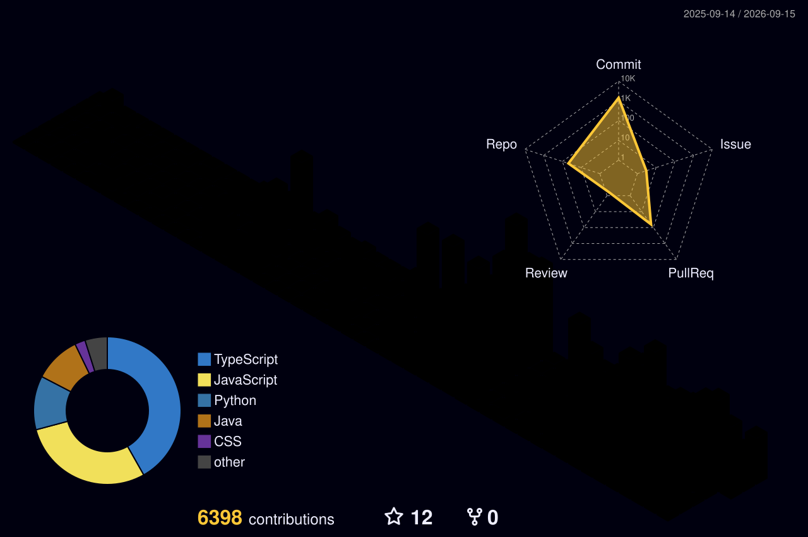

<div align="center">

<a href="https://orb21.com">
  
</a>

<br/>
<br/>

[](https://imranisdev.top)
[](https://linkedin.com/in/imranshiundu)
[](https://twitter.com/imranshiundu)
[](https://reddit.com/user/imranshiundu)
[](https://github.com/imranshiundu)
[](mailto:imranshiundu@gmail.com)

</div>

<br />

## About Me

```javascript
const imran = {
  role: "Founder & Full Stack Engineer",
  company: "Orb21",
  motto: "You focus on the idea, we'll handle the execution.",
  expertise: {
    backend: ["Java", "Spring Boot", "Microservices"],
    frontend: ["Next.js", "React", "TypeScript"],
    infrastructure: ["Supabase", "AWS", "Docker"],
    design: ["Tailwind CSS", "Modern UI/UX"]
  },
  currentFocus: "Scaling Orb21 to empower startup founders globally.",
  philosophy: "Great code is simple, scalable, and solves real problems.",
  openToWork: true,
  availableFor: [
    "Full-time opportunities",
    "Contract projects",
    "Technical consulting",
    "Open source collaborations",
    "Startup partnerships"
  ]
};
```

<br />

## Open to Opportunities

<div align="center">

[](mailto:imranshiundu@gmail.com)
[](https://imranisdev.top)
[](https://github.com/imranshiundu)

</div>

### What I'm Looking For

<table>
<tr>
<td width="33%" align="center">

**Full-Stack Roles**

Java/Spring Boot or Next.js/React positions in product companies or innovative startups

</td>
<td width="33%" align="center">

**Consulting Projects**

Technical architecture, API design, and full-stack development consulting

</td>
<td width="33%" align="center">

**Collaborations**

Open source projects, startup co-founding, and technical mentorship

</td>
</tr>
</table>

### Why Work With Me?

- **Startup Founder Experience** - Built and scaled Orb21 from concept to production
- **Full-Stack Expertise** - Backend (Java/Spring Boot) + Frontend (Next.js/React)
- **Product Mindset** - Focus on solving real problems, not just writing code
- **Fast Learner** - Quick to adapt to new technologies and team dynamics
- **Remote-First** - Experienced in distributed team collaboration

<br />

## Featured Projects

<table>
<tr>
<td width="50%" valign="top">

### Orb21
**Premier execution platform for startups**

> "You focus on the idea, we'll handle the execution."

[](https://orb21.com)

Fast-track your startup from concept to launch with a team dedicated to turning your vision into reality.

</td>
<td width="50%" valign="top">

### Portfolio
**High-performance web showcase**

[](https://imranisdev.top)

```yaml
Stack: Next.js, React, Tailwind CSS
Features: Premium UI/UX, Fast Performance
```

A visually immersive portfolio showcasing technical capabilities and design excellence.

</td>
</tr>
</table>

<br />

## Core Competencies

<table>
<tr>
<td width="25%" align="center">

**Backend Development**


</td>
<td width="25%" align="center">

**Frontend Development**


</td>
<td width="25%" align="center">

**Cloud & DevOps**


</td>
<td width="25%" align="center">

**Soft Skills**


</td>
</tr>
</table>

<br />

## Tech Stack

<div align="center">
  <a href="https://skillicons.dev">
    
  </a>
</div>

<br />

## GitHub Statistics

<div align="center">


</div>

<br />

## 3D Contribution Graph

<div align="center">



</div>

<br />

## Contribution Activity

<div align="center">


</div>

<br />

## Snake Eating My Contributions

<div align="center">

<picture>
  <source media="(prefers-color-scheme: dark)" srcset="https://raw.githubusercontent.com/imranshiundu/imranshiundu/output/github-contribution-grid-snake-dark.svg">
  <source media="(prefers-color-scheme: light)" srcset="https://raw.githubusercontent.com/imranshiundu/imranshiundu/output/github-contribution-grid-snake.svg">
  
</picture>

</div>

<br />

## Achievements

<div align="center">


</div>

<br />

## Philosophy

<div align="center">

> **"The best code is code that doesn't need to be written. The second best is code that's so simple it obviously has no deficiencies."**
> 
> Building with intention, scaling with precision.

</div>

<br />

<div align="center">


</div>

<br />

## How to Reach Me for Collaboration

<div align="center">

### Quick Collaboration Request

[](https://github.com/imranshiundu/imranshiundu/issues/new/choose)

**Click above and I'll get an email notification within minutes!**

---

**I respond to collaboration requests within 24 hours!**

<table>
<tr>
<td align="center" width="33%">

### Email (Fastest)

[](mailto:imranshiundu@gmail.com)

**imranshiundu@gmail.com**

Best for: Project proposals, partnerships, consulting inquiries

</td>
<td align="center" width="33%">

### LinkedIn

[](https://linkedin.com/in/imranshiundu)

Best for: Professional networking, job opportunities

</td>
<td align="center" width="33%">

### Portfolio Contact

[](https://imranisdev.top)

Best for: Viewing my work + contact form

</td>
</tr>
</table>

**GitHub doesn't notify me when someone wants to collaborate via my profile.**  
**Please use the contact methods above to reach out!**

</div>

<br />

---

<div align="center">

### Let's Build Something Amazing Together

**Available for immediate collaboration on exciting projects**

[](mailto:imranshiundu@gmail.com)
[](https://imranisdev.top)
[](mailto:imranshiundu@gmail.com)

<br />

<div align="center">


<div align="center">
  <b>© 2026 Imran Shiundu • Built with ❤️ & Code</b><br />
  <a href="#imran-shiundu">Back to Top ⬆️</a>
</div>

<br />


</div>

<br />

<div align="center">
<details>
<summary><b>Search Keywords (SEO)</b></summary>
<br />
Full Stack Developer • Java Developer • Spring Boot Expert • Next.js Developer • React Developer • TypeScript • Supabase • Software Engineer • Startup Founder • Technical Consultant • Microservices Architecture • API Development • Frontend Developer • Backend Developer • Remote Developer • Kenya Developer • African Tech • Open Source Contributor • Available for Hire • Software Architect • Cloud Computing • AWS • Docker • PostgreSQL • Web Development • Mobile Development • UI/UX • Tailwind CSS • Modern Web Applications • SaaS Development • Enterprise Applications
</details>
</div>


</div>